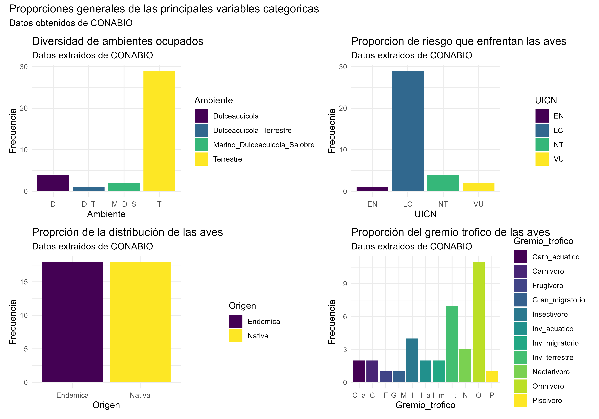
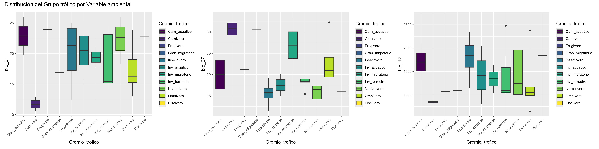
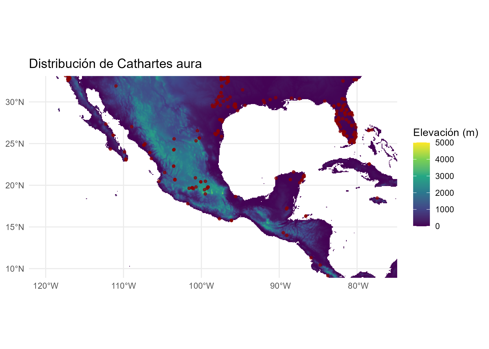
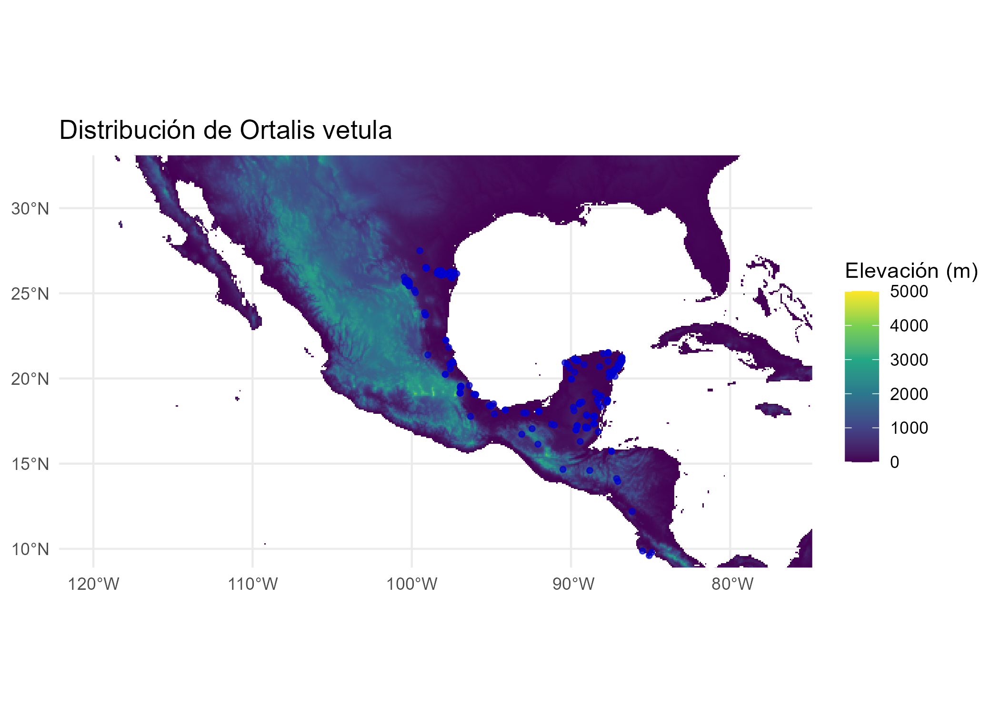
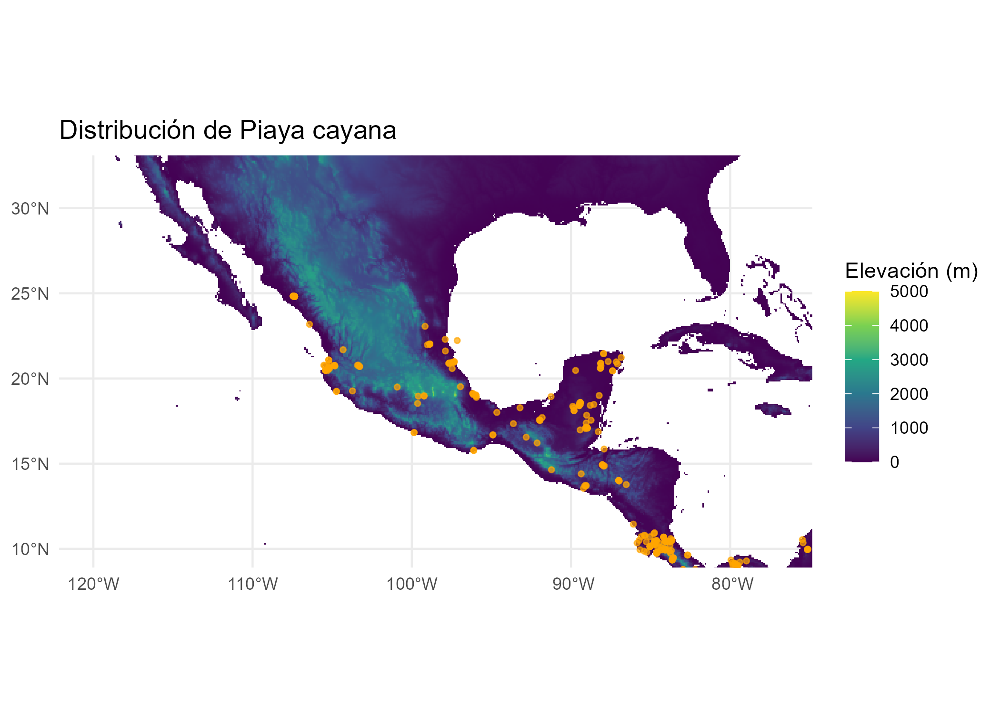
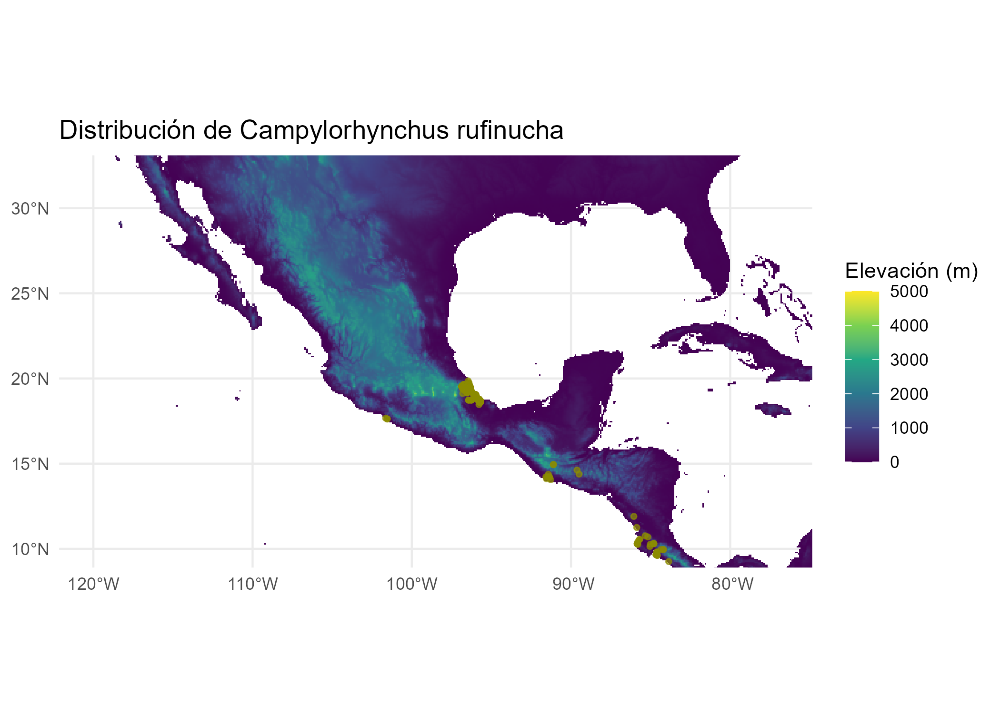
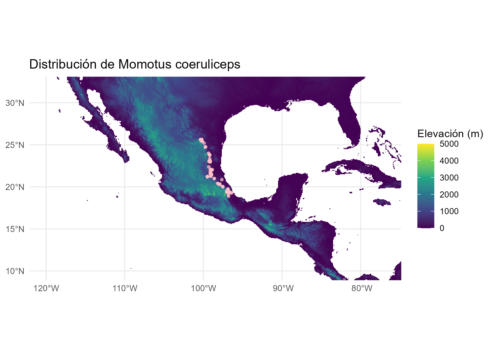

<div style="text-align: justify;">
# Relación del estado de riesgo UICN con el ambiente, el grupo trófico y las condiciones ambientales en aves endémicas y nativas del estado de Veracruz, México.


**Trabajo realizado por:**

* Héctor Alejandro Nájera Hogas

* Andoni Arrubarrena Honicke

* Pablo Adahir Maldonado Martínez

### **Librerias requeridas**
```{r message=FALSE, warning=FALSE}
library(tidyverse) #Conjunto de paquetes para manipulación y visualización de datos
library(ggplot2) #(incluido en tidyverse) - Sistema de gráficos elegantes
library(patchwork) #Combinar múltiples gráficos en uno
library(ggcorrplot) #Visualización de matrices de correlación
library(ggfortify) #Visualización de resultados de análisis multivariado
library(paletteer) #Colección completa de paletas de colores
library(viridis) #Paleta de colores específica
library(grid) #Sistema gráfico de bajo nivel
library(magick) #Manipulación de imágenes

library(sf) #Trabajar con datos vectoriales (puntos, líneas, polígonos)
library(terra) #Manipulación de datos raster (imágenes satelitales, modelos digitales)
library(tidyterra) #Integración entre terra y tidyverse
library(geodata) #Descargar datos geoespaciales (clima, elevación, etc.)
library(rworldxtra) #Mapas mundiales de alta resolución
library(ggspatial) #Elementos para mapas (escalas, norte, etc.)

library(rgbif) #Acceder a datos de Global Biodiversity Information Facility (GBIF)
library(vegan) #Análisis ecológicos y de comunidades (diversidad, ordenación)

library(factoextra) #Visualización de resultados de análisis multivariado
library(FactoMineR) #Análisis de componentes principales (PCA) y multivariado

#PENDIENTE
library(ggridges) #Gráficos de distribución tipo "ridge"
library(plotly) #Gráficos interactivos
```


## <span style="color:seagreen;">1.Introducción</span>

La degradación del medio ambiente, en especial en las zonas asociadas a costas y cuerpos dulceacuícolas, es una realidad que avanza con una velocidad alarmante. A lo largo del estado de Veracruz no es posible encontrar una causa especifica, sino más bien un problema multifactorial a gran escala, como: contaminación por residuos industriales y petroleros, exceso de fertilizantes nitrogenados, pérdida de costa por el aumento del nivel del mar, sequías cada vez más frecuentes, alteraciones en el régimen de lluvias y erosión constante de suelos en zonas de ladera comprometen la calidad y extensión de los nichos disponibles, generando un desequilibrio que se refleja directamente en la composición y dinámica de las comunidades biológicas (Primack,2002). A pesar de que existen múltiples estudios sobre biodiversidad o conservación, pocos abordan la relación directa entre el estado de riesgo (específicamente, aquel determinado por la UICN), el tipo de ambiente y las condiciones ambientales específicas, además se vuelve más evidente cuando se analizan especies con grupos tróficos especializados, ya que cualquier cambio ambiental puede provocar efectos en cascada que alteran tanto las redes tróficas como la estabilidad ecológica general.

El caso de las aves endémicas y nativas de Veracruz es particularmente relevante, considerando que este estado concentra una enorme diversidad biológica, influenciada por su posición geográfica, sus gradientes altitudinales y su variedad de climas y ecosistemas, sin mencionar que es uno de los sitios de paso más importantes de aves migratorias a nivel mundial (Peterson et al., 2000)

Con este trabajo se busca explorar de manera integrada cómo se relacionan las categorías de riesgo de la UICN, los ambientes que ocupan y los grupos tróficos que representan, considerando además las condiciones ambientales predominantes de sus hábitats. La intención es identificar posibles patrones entre la especialización ecológica y el nivel de amenaza, lo cual puede ofrecer pistas sobre la vulnerabilidad diferencial de las especies y sobre qué factores ambientales podrían estar actuando como motores del riesgo en Veracruz.


## <span style="color:seagreen;">2.Pregunta de Investigación</span>

### **¿Cómo se relacionan los factores ligadas al nicho de las especies con su estado de peligro y como se agrupan estos datos?**

Para poder responder a estas preguntas, se busca obtener datos que cubran las siguientes variables:

* Estado de Peligro

* Grupo trofico

* Tipo de Ambiente/Habitat

* Variables Ambientales

Con el objetivo de conocer las posibles relaciones entre estas variables y advertir de manera correcta si el grado de especialización o algun ambiente en especifico podría estar relacionado con un mayor riesgo de extinción.

## <span style="color:seagreen;">3.Obtención y transformación de los datos</span>

### **Extracción y acomodo de datos**

### Selección de especies

En primera instancia se seleccionaron 36 especies, 18 endemicas y 18 nativas a través de una base de datos de aves del estado de Veracruz, porporcionada por CONABIO mediante el portal enciclovida.

Consiguiente a ello, se seleccionó el portal de GBIF como la fuente de registros de cada especie seleccionada.

```{r}
#-----Extracción de los registros desde GBIF
#Ejemplo con Catartes aura
Ca_au_sp <- occ_search(
  scientificName = "Cathartes aura",
  hasCoordinate = TRUE,
  hasGeospatialIssue = FALSE
)$data

#Se descargo y guardo cada registro de las 36 especies de manera individual con  el siguiente formato:
#Primeras dos letras del epiteto generico_Primeras dos  letras del epiteto especifico_sp
```
```{r}
#Se utilizará la función filter para seleccionar los datos de mayor confianza posible
Ca_au_sp <- Ca_au_sp %>%
  filter(basisOfRecord %in% c("HUMAN_OBSERVATION", "PRESERVED_SPECIMEN"))
```
```{r}
#Se convirtira en un archivo espacial para poder extraer los datos climaticos de World clim
Ca_au_sp_vect <- vect(Ca_au_sp, geom = c("decimalLongitude", "decimalLatitude"), crs = "EPSG:4326")
```

### Obtención de las variables climáticas

Siguiente a esto, obtuvimos nuestras variables climáticas a partir del portal de datos climatológicos WordClim; usando específicamente las siguientes variables, por cada especie:

* BIO 1:Annual Mean Temperature (Promedio de temperatura anual)

* BIO 7: Temperature Annual Range (Rango de temperatura anual)

* BIO 12: Annual Precipitation (Precipitación anual)

```{r}
#-------Extracción de capas climáticas
#Para extraer las capas clímaticas
env <- worldclim_global(var = "bio", res = 10, path = "datos_wc")
```
```{r}
#Para nombrar las capas clímaticas
v_names <- vector()
for(i in 1:19){
  v_names[i] <- paste0("bio_", sprintf("%02d", i))
}

names(env) <- v_names
```
```{r}
#Se extraen los datos climaticos a traves del archivo vectorial, ademas de agregar la columna de species
Ca_au_env <- extract(env, Ca_au_sp_vect) 

Ca_au_env$species <- c("Cathartes aura")
```

### Filtro de selección para variables climáticas

Se aplica el primer filtro para solo seleccionar las variables climáticas que creemos necesarias, precipitación promedio anual, temperatura promedio annual y rango de temperatura.

```{r}
#Se seleccionarán solo las 3 variables de nuestro interes
Ca_au_env <- Ca_au_env %>%
  select(species, bio_01, bio_07, bio_12)

#Solo para visualizar el correcto procesamiento
head(Ca_au_env)
```

Esta guía de pasos se realizó 36 veces, una vez por cada especie presente en nuestra base de datos

Estos 36 data frames fueron unidos con la función Aves_clima <- rbind(df1, df2, ...) 

### Promedio de las observaciones por variables

Aplicamos una segunda modificación de los datos agrupando y calculando los promedios de las observaciones por variables.

```{r}
#Vamos a agrupar las observaciones climaticas por especie para despues obtener el promedio de cada una
Aves_clima <- Ca_au_env %>%
  group_by(species) %>%      
  summarise(
    bio_01_prom = mean(bio_01, na.rm = TRUE),
    bio_07_prom = mean(bio_07, na.rm = TRUE),
    bio_12_prom = mean(bio_12, na.rm = TRUE)
  )
```

Tras este proceso obtenemos nuestra base de datos climática completa

### **Cargar bases de datos**

```{r}
#Cargamos la base de datos climáticos
Aves_clima <- read.csv("Aves_clima.csv")
class(Aves_clima)
```

De la misma forma cargamos los datos de la base de datos de CONABIO de las 36 aves antes mencionada, desglose de su contenido:

* Especie cientifica = Nombre cientifico de la especie

* Origen = Si es Nativa o Endemica

* N_observaciones = Numero de observaciones totales por especie

* Nombre_comun = Nombre comun de la especie

* Ambiente = Tipo de habitad que ocupan las especies

* UICN = Nivel de amenaza de la especie por el sistema UICN

* Gremio_trofico = Gremio trofico alimenticio o espacial de la especie

```{r}
#Cargamos el csv correspondiente a la base de datos Obtenida de CONABIO
Aves_CONABIO <- read.csv("Aves_CONABIO.csv")
class(Aves_CONABIO)
```

### Unión de bases de datos

Se realiza la union de la base de datos ademas de guardarla como csv.

```{r}
#Por ultimo unimos nuestra base climatica con la descargada de CONABIO.
Aves_completa <- full_join(Aves_clima, Aves_CONABIO, by = join_by ("species" == "Especie_cientifica"))

#Guardamos nuestra base de datos
#write.csv(Aves_completa, file = "Aves_completa.csv", row.names = FALSE)
```
```{r}
#Cargamos la base de datos completa
Aves_completa <- read.csv("Aves_completa.csv")
class(Aves_completa)
```

## <span style="color:seagreen;">4.Análisis generales y descriptivos</span>

### **Tablas de frecuencia para variables categóricas**

```{r}
# Tablas de frecuencia para variables categóricas
table(Aves_completa$UICN)
```
```{r}
table(Aves_completa$Gremio_trofico)
#Carn_acuatico: Carnívoro acuático
#Carnivoro
#Frugivoro
#Gran_migratorio: Generalista pero migratorio
#Insectivoro 
#Inv_acuatico: Consume invertebrados acuáticos
#Inv_migratorio: Consume invertebrados pero es migratorio
#Inv_terrestre: Consume invertebrados terrestres
#Nectarivoro
#Omnivoro 
#Piscivoro 

```
```{r}
table(Aves_completa$Ambiente)
table(Aves_completa$Origen)
```

### Representaciones gráficas

Se realizó una representación gráfica de esta matriz para mostrar las proporciones de cada variable de nuestra base de datos.

```{r}
# Representación gráfica

GG_O <- ggplot(Aves_completa, aes(x=Origen, fill=Origen))+
  geom_bar()+
  theme_minimal()+
  scale_fill_viridis_d(option = "D")+
  labs( title = "Proprción de la distribución de las aves", subtitle = "Datos extraidos de CONABIO", y="Frecuencia")

GG_O

GG_A <- ggplot(Aves_completa, aes(x=Ambiente, fill=Ambiente))+
  geom_bar()+
  theme_minimal()+
  scale_x_discrete(labels = c(
    "Terrestre" = "T",
    "Dulceacuicola_Terrestre" = "D_T",
    "Dulceacuicola" = "D",
    "Marino_Dulceacuicola_Salobre" = "M_D_S"
  )) +
  scale_fill_viridis_d(option = "D")+
  labs( title = "Diversidad de ambientes ocupados", subtitle = "Datos extraidos de CONABIO", y="Frecuencia")
  
GG_A

GG_U <- ggplot(Aves_completa, aes(x=UICN, fill=UICN))+
  geom_bar()+
  theme_minimal()+
  scale_fill_viridis_d(option = "D")+
  labs( title = "Proporcion de riesgo que enfrentan las aves", subtitle = "Datos extraidos de CONABIO", y="Frecuecnia")

GG_U

GG_G <- ggplot(Aves_completa, aes(x=Gremio_trofico, fill=Gremio_trofico))+
  geom_bar()+
  theme_minimal()+
  scale_fill_viridis_d(option = "D")+
  scale_x_discrete(labels = c(
    "Carn_acuatico" = "C_a",
    "Carnivoro" = "C",
    "Frugivoro" = "F",
    "Gran_migratorio" = "G_M",
    "Insectivoro"= "I",
    "Inv_acuatico" = "I_a",
    "Inv_migratorio" ="I_m",
    "Inv_terrestre" ="I_t",
    "Nectarivoro" ="N",
    "Omnivoro" ="O",
    "Piscivoro"= "P"
  )) +
  labs( title = "Proporción del gremio trofico de las aves", subtitle = "Datos extraidos de CONABIO", y="Frecuencia")
GG_G
```

### Se fusionan estos gráficos a traves de patchwork

```{r}
#Fusión de los graficos mediante patchwork

GG_T <-  wrap_plots(GG_A, GG_U, GG_O, GG_G, ncol = 2) +
  plot_annotation(
    title = "Proporciones generales de las principales variables categoricas",
    subtitle = "Datos obtenidos de CONABIO",
  )
# Guardar el gráfico con alta resolución
ggsave(filename = "GG_T.png",   plot = GG_T, width = 10,height = 7, dpi = 400,units = "in", bg = "white")

```



### **Matriz de correlación entre variables numéricas**

```{r}
#Hacemos una paleta de colores con viridis.
paleta <- colorRampPalette(viridis(option = "D", n = 100))(100)
```
```{r}
# Matriz de correlación entre variables numéricas
cor_aves <- cor(Aves_completa[,c("bio_01", "bio_07", "bio_12", "No_observaciones")])
corrplot::corrplot(cor_aves, tl.col = "black", col=paleta)
```

### **Cluster de agrupamiento de las variables climáticas por especie de ave**

```{r}
# Cluster por variables ambientales
cluster_aves <- scale(Aves_completa[,c("bio_01", "bio_07","bio_12")])
kmeans_result <- kmeans(cluster_aves, centers = 3)

#Creamos un vector para nombrar la escala
etiquetas <- c("Temperatura promedio anual", "Rango de Temperatura", "Precipitación Anual")
```
```{r}
fviz_cluster(kmeans_result, data = cluster_aves, palette  = c("#4B0055","#009796","#FDE333"))
```

Donde, el cluster 1 es la variable bio_01, el cluster 2 es la variable bio_07 y el cluster 3 es la variable bio_12.

### **Boxplot por cada variable ambiental y las categorias de grupo trofico**

```{r}
# Boxplots por categorías
bxp1 <- ggplot2::ggplot(Aves_completa) +
  geom_boxplot(aes(x = Gremio_trofico, y = bio_01, fill = Gremio_trofico)) +
  theme(axis.text.x = element_text(
    angle = 45,      
    hjust = 1
  )) +
  scale_fill_viridis_d(option = "viridis") 
bxp1
bxp2 <- ggplot2::ggplot(Aves_completa) +
  geom_boxplot(aes(x = Gremio_trofico, y = bio_07, fill = Gremio_trofico))  +
  theme(axis.text.x = element_text(
    angle = 45,      
    hjust = 1
  )) +
  scale_fill_viridis_d(option = "viridis") 
bxp2
bxp3 <- ggplot2::ggplot(Aves_completa) +
  geom_boxplot(aes(x = Gremio_trofico, y = bio_12, fill = Gremio_trofico))  +
  theme(axis.text.x = element_text(
    angle = 45,      
    hjust = 1
  )) +
  scale_fill_viridis_d(option = "viridis") 
bxp3
```

### Se fusionan estos gráficos a traves de patchwork

```{r}
#Fusión de los graficos mediante patchwork

bxp_T <-  wrap_plots(bxp1, bxp2, bxp3, ncol = 3) +
  plot_annotation(
    title = "Distribución del Grupo trófico por Variable ambiental"
  )
# Guardar el gráfico con alta resolución
ggsave(filename = "bxp_T.png",   plot = bxp_T, width = 20,height = 5, dpi = 400,units = "in", bg = "white")

```




### **Diversidad por cada categoria**

```{r}
# Diversidad por categorías
diversidad1 <- diversity(table(Aves_completa$Gremio_trofico, Aves_completa$UICN))
diversidad1
diversidad2 <- diversity(table(Aves_completa$Ambiente, Aves_completa$UICN))
diversidad2
diversidad3 <- diversity(table(Aves_completa$Origen, Aves_completa$UICN))
diversidad3
```
```{r}
# Primero combinar los dataframes correctamente
diversidades <- data.frame(
  Categoría = c(rep("Gremio Trófico", length(diversidad1)),
                rep("Ambiente", length(diversidad2)),
                rep("Origen", length(diversidad3))),
  Diversidad = c(diversidad1, diversidad2, diversidad3)
)
```
```{r}
ggplot(data = diversidades, aes(x = Categoría, y = Diversidad, fill = Categoría)) +
  geom_bar(stat = "identity") +
  scale_fill_viridis_d() +  # _d para variables discretas
  labs(title = "Diversidad por Categoría", x = "Categoría", y = "Diversidad")
```

### **Mapa de distribución de las condiciones ambientales por grupo trófico y estado de peligro**

```{r}
## Mapas de distribución de condiciones ambientales por gremio trófico y estado de peligro
ggplot(Aves_completa) +
  geom_point(aes(x = bio_01, y = bio_12, 
                 color = Gremio_trofico, size = No_observaciones)) +
  facet_wrap(~UICN) +
  scale_color_viridis_d(option = "viridis")
```

## <span style="color:seagreen;">5.Análisis por PCA</span>

### Por último...

Se busco realizar un PCA (Análisis de Componentes Principales) para ayudarnos a descubrir relaciones en los datos y a identificar qué variables son las más importantes. Sin embargo 3 de nuestras variables de interés son consideradas variables categóricas que por la naturaleza de el PCA, no permíte su compatibilidad; ante esto se opto por convertirlas a magnitudes numéricas

### Conversión de variables categóricas en magnitudes numéricas por un orden lógico

```{r}
#Transformación de variables categóricas a magnitudes numéricas

uicn_orden <- c("LC" = 1,  
                "NT" = 2,  
                "VU" = 3,  
                "EN" = 4,  
                "CR" = 5,  
                "EW" = 6,  
                "EX" = 7) 
Aves_numerica<- Aves_completa %>%
  mutate(UICN_num = uicn_orden[UICN])
```

Se convirtió la variable de UICN de manera lógica en función de asignar números más grandes a mayores grados de riesgo haciendolos compatibles con PCA.

```{r}
gremio_orden <- c("Omnivoro" = 1,
                  "Carnivoro" = 2,
                  "Insectivoro" = 2,
                  "Frugivoro" = 2,
                  "Nectarivoro" = 3,
                  "Piscivoro" = 2,
                  "Carn_acuatico" = 3,
                  "Inv_terrestre" = 3,
                  "Inv_acuatico" = 3,
                  "Inv_migratorio" = 4,
                  "Gran_migratorio" = 4)

Aves_numerica <- Aves_numerica %>%
  mutate(Gremio_num = gremio_orden[`Gremio_trofico`])
```

Se convirtio la variable de gremio de manera logica en funcion de el grado de especialización, en el siguiente orden, Omnivoro se eligio como el orden mas bajo debido a su flexibilidad ecologica, Voros con alimento más limitado como segundos, Nectarivoros y con limitaciones espaciales como Carn_acuatico se colocaron despues, y las migratorias con el valor más alto debido no solo a su limitante espacial, si no por su limitante temporal.

```{r}
Aves_numerica <- Aves_numerica %>%
  mutate(
    Ambiente_num = case_when(
      Ambiente == "Terrestre" ~ 1,
      Ambiente == "Dulceacuicola_Terrestre" ~ 2,
      Ambiente == "Dulceacuicola" ~ 3,
      Ambiente == "Dulceacuicola_Salobre" ~ 4,
      Ambiente == "Marino_Dulceacuicola_Salobre" ~ 5,
      TRUE ~ NA_real_
    )
  )
```

Finalmente, se convirtió la variable Ambiente de manera lógica en función de el grado de dependencia a cuerpos de agua, esto respaldando el enfoque hacia los cuerpos de agua mencionado en la introducción.

Se guardo la base de dasos como csv.

```{r}
#Guardado de la base numerica
write_csv(Aves_numerica, "Aves_numerica.csv")

Aves_numerico <- read.csv("Aves_numerica.csv")
```

### **PCA**

```{r}
data1 <- Aves_numerica[, c(2,3,4,13,11,12)]# Solo las variables numéricas

# Realizar PCA 1 (sin observaciones)
pca1 <- prcomp(data1, scale = TRUE)  # scale = TRUE para estandarizar
pca1
```
```{r}
summary(pca1)
```
```{r}
#Biplot 
autoplot(pca1, data1 = Aves_numerico, #colour = 'Species',
         loadings = TRUE, loadings.colour = '#481C66',
         loadings.label.colour = 'black',
         loadings.label = TRUE, loadings.label.size = 3) +
  theme_minimal()+
  labs( title = "PCA sin considerar las observaciones", subtitle = "Datos extraidos de CONABIO y GBIF")
```


## <span style="color:seagreen;">6.Conclusiones</span>

Se realizó la graficación de la distribución de las especies estudiadas;
por motivos de tiempo, solo se ejemplificarán 5 de ellas (la primera con
objeto de ejemplo y las otras cuatro siendo las 2 más abundantes de sus
respectivas categorías [2 nativas y 2 endémicas]).


### **Cathartes aura**

```{r}
#Ahora vamos a visualizar los datos
Ca_au_sp <- occ_search(
  scientificName = "Cathartes aura",
  hasCoordinate = TRUE,
  hasGeospatialIssue = FALSE
)$data

Ca_au_sp <- Ca_au_sp %>%
  filter(basisOfRecord %in% c("HUMAN_OBSERVATION", "PRESERVED_SPECIMEN"))
```

### Cargamos una capa raster de altitud

```{r message=FALSE, warning=FALSE}
wcg_h <- worldclim_global(var="elev", res=5, path=tempdir())
```

### Cargamos archivos vectoriales

```{r}
data(countriesHigh)
```

### Designamos un objeto que tiene datos del mundo de manera espacial

```{r}
Mundo <- st_as_sf(countriesHigh) 
```

### Ahora convertimos Ca_au_sp a objeto sf

```{r}
Ca_au_sp_sf <- st_as_sf(Ca_au_sp, 
                        coords = c("decimalLongitude", "decimalLatitude"),
                        crs = 4326)  # WGS84
```

### Y hacemos una graficación simple del mapa de distribución de la especie

```{r}
map1 <- ggplot() +
  geom_spatraster(data = wcg_h, aes(fill = after_stat(value)), maxcell = Inf) +
  geom_sf(data = Ca_au_sp_sf, color = "red4", size = 1, alpha = 0.7) +
  coord_sf(xlim = c(-120, -77), ylim = c(10, 32)) +
  scale_fill_viridis_c(
  limits = c(0, 5000),
  na.value = "transparent",
  option = "viridis"
) +
  labs(title = "Distribución de Cathartes aura",
       fill = "Elevación (m)") +
  theme_minimal()

ggsave(map1, file = "map1.png")
```




### Y repetimos este proceso para las otras cuatro:

### **Ortalis vetula**

```{r Or_ve}
#Ortalis vetula
Or_ve_sp <- occ_search(
  scientificName = "Ortalis vetula",
  hasCoordinate = TRUE,
  hasGeospatialIssue = FALSE
)$data

Or_ve_sp <- Or_ve_sp %>%
  filter(basisOfRecord %in% c("HUMAN_OBSERVATION", "PRESERVED_SPECIMEN"))

Or_ve_sp_sf <- st_as_sf(Or_ve_sp, 
                        coords = c("decimalLongitude", "decimalLatitude"),
                        crs = 4326) #WGS84

map2 <- ggplot() +
  geom_spatraster(data = wcg_h, aes(fill = after_stat(value)), maxcell = Inf) +
  geom_sf(data = Or_ve_sp_sf, color = "blue3", size = 1, alpha = 0.7) +
  coord_sf(xlim = c(-120, -77), ylim = c(10, 32)) +
  scale_fill_viridis_c(
  limits = c(0, 5000),
  na.value = "transparent",
  option = "viridis"
) +
  labs(title = "Distribución de Ortalis vetula",
       fill = "Elevación (m)") +
  theme_minimal()

ggsave(map2, file = "map2.png")
```


### **Piaya cayana**

```{r Pi_ca}
#Piana cayana
Pi_ca_sp <- occ_search(
  scientificName = "Piaya cayana",
  hasCoordinate = TRUE,
  hasGeospatialIssue = FALSE
)$data

Pi_ca_sp <- Pi_ca_sp %>%
  filter(basisOfRecord %in% c("HUMAN_OBSERVATION", "PRESERVED_SPECIMEN"))

Pi_ca_sp_sf <- st_as_sf(Pi_ca_sp, 
                        coords = c("decimalLongitude", "decimalLatitude"),
                        crs = 4326) #WGS84

map3 <- ggplot() +
  geom_spatraster(data = wcg_h, aes(fill = after_stat(value)), maxcell = Inf) +
  geom_sf(data = Pi_ca_sp_sf, color = "orange", size = 1, alpha = 0.7) +
  coord_sf(xlim = c(-120, -77), ylim = c(10, 32)) +
  scale_fill_viridis_c(
  limits = c(0, 5000),
  na.value = "transparent",
  option = "viridis"
) +
  labs(title = "Distribución de Piaya cayana",
       fill = "Elevación (m)") +
  theme_minimal()

ggsave(map3, file = "map3.png")
```


### **Campylorhynchus rufinucha**

```{r Ca_ru}
#Campylorhynchus rufinucha
Ca_ru_sp <- occ_search(
  scientificName = "Campylorhynchus rufinucha",
  hasCoordinate = TRUE,
  hasGeospatialIssue = FALSE
)$data

Ca_ru_sp <- Ca_ru_sp %>%
  filter(basisOfRecord %in% c("HUMAN_OBSERVATION", "PRESERVED_SPECIMEN"))

Ca_ru_sp_sf <- st_as_sf(Ca_ru_sp, 
                        coords = c("decimalLongitude", "decimalLatitude"),
                        crs = 4326) #WGS84

map4 <- ggplot() +
  geom_spatraster(data = wcg_h, aes(fill = after_stat(value)), maxcell = Inf) +
  geom_sf(data = Ca_ru_sp_sf, color = "yellow4", size = 1, alpha = 0.7) +
  coord_sf(xlim = c(-120, -77), ylim = c(10, 32)) +
   scale_fill_viridis_c(
  limits = c(0, 5000),
  na.value = "transparent",
  option = "viridis"
) +
  labs(title = "Distribución de Campylorhynchus rufinucha",
       fill = "Elevación (m)") +
  theme_minimal()

ggsave(map4, file = "map4.png")
```


### **Momotus coeruliceps**

```{r Mo_co}
#Momotus coeruliceps
Mo_co_sp <- occ_search(
  scientificName = "Momotus coeruliceps",
  hasCoordinate = TRUE,
  hasGeospatialIssue = FALSE
)$data

Mo_co_sp <- Mo_co_sp %>%
  filter(basisOfRecord %in% c("HUMAN_OBSERVATION", "PRESERVED_SPECIMEN"))

Mo_co_sp_sf <- st_as_sf(Mo_co_sp, 
                        coords = c("decimalLongitude", "decimalLatitude"),
                        crs = 4326) #WGS84

map5 <- ggplot() +
  geom_spatraster(data = wcg_h, aes(fill = after_stat(value)), maxcell = Inf) +
  geom_sf(data = Mo_co_sp_sf, color = "pink", size = 1, alpha = 0.7) +
  coord_sf(xlim = c(-120, -77), ylim = c(10, 32)) +
  scale_fill_viridis_c(
  limits = c(0, 5000),
  na.value = "transparent",
  option = "viridis"
  ) +
  labs(title = "Distribución de Momotus coeruliceps",
       fill = "Elevación (m)") +
  theme_minimal()

ggsave(map5, file = "map5.png")
```



### **El estudio reflejó varios puntos finales a destacar:**

* Se pudo concluir que hay una relación directa entre los grupos funcionales y el estado de peligro de las especies, teniendo una mayor proporción de especies generalistas ante las especialistas (probablemente debido a la alta perturbación de sus ambientes).

* La mayor proporción de riqueza en el estudio fue por medio de la variable de gremios funcionales,  debido a la diversidad y variabilidad del mismo ante otras variables como el ambiente.

* Las variables más correlacionadas resultaron las capas bio 1 (Mayor temperatura anual) y bio 12, (Mayor precipitación anual), así como también la categoría de peligro (IUCN) y el ambiente (hábitat).

Con los resultados y contribuciones de este estudio se plantea que nuestro estudio pueda servir como un parteaguas para la realización de eventuales estudios relacionados que contribuyan consecuentemente a una respuesta más profunda de la incógnita planteada, ya que la busqueda del conocimiento nunca cesa.

</div>